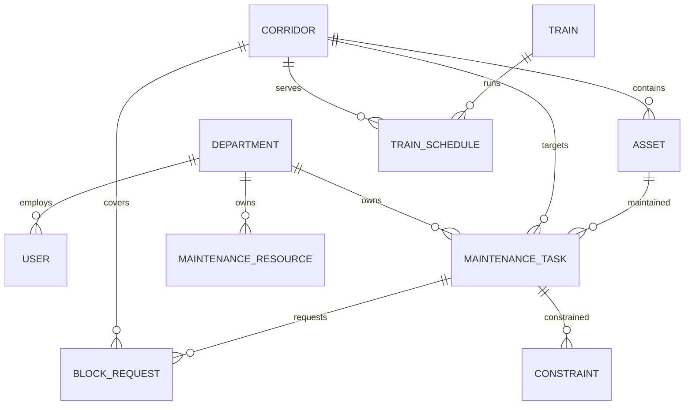

# PS27 – Part 1: Data Layer and Backend Foundation – Implementation Plan

## 1. Scope

Build a clean Spring Boot backend foundation for managing railway maintenance planning data, strictly limited to Part 1.

### In scope
- Java 17 + Spring Boot 3 (Web, Data JPA, Validation) + Maven
- JPA entities for the core Part 1 data model
- Repositories, services, DTOs, controllers (layered architecture)
- Basic CRUD/read APIs for: maintenance tasks, assets, corridors, trains, train schedules, resources, departments, users, constraints, block requests
- Corridor availability (read-only listing of schedules + blocks, NO conflict logic)
- CSV import for maintenance tasks (per docs: "Create/import maintenance tasks")
- Consistent REST error handling + bean validation
- H2 (PostgreSQL mode) for local dev/tests; PostgreSQL profile via env vars for later Supabase
- Synthetic sample data seeder (dev profile) + sample CSV files
- Unit/API tests; Maven build must pass

### Out of scope (later parts)
- Optimization, conflict detection, block plans, audit logs, auth/security, AI/ML, Firebase, cloud infra, frontend
- Tables deferred to later parts: `block_plans`, `block_plan_tasks`, `conflicts`, `optimization_runs`, `optimization_results`, `audit_logs`

## 2. Architecture

```
Controller (DTO in/out)
   ↓
Service (business rules, validation, mapping)
   ↓
Repository (Spring Data JPA)
   ↓
Database (H2 PostgreSQL-mode local / PostgreSQL prod)
```

## 3. Data model (source of truth: Part-1 docs 07/08 + optimization inputs in Part 4/5)

| Entity | Table | Notes |
|---|---|---|
| Department | departments | name, code unique |
| User | users | username/email unique, full_name, role enum Admin/DepartmentUser/Planner/Approver, active, department FK. Credentials/auth deferred to Part 2. |
| Corridor | corridors | name, code unique, start/end location, length_km, status |
| Asset | assets | code unique, name, asset_type, corridor FK, track_km, status |
| Train | trains | code unique, name, train_type, active |
| TrainSchedule | train_schedules | train FK, corridor FK, schedule_date, day_of_week (recurring), departure_time, arrival_time, direction |
| MaintenanceTask | maintenance_tasks | task_code unique, title, description, task_type, priority, duration_minutes, corridor FK, asset FK (optional), department FK, requested_start/end, earliest_start/latest_end (allowed window), status, notes; self-dependency join `maintenance_task_dependencies` |
| MaintenanceResource | maintenance_resources | code unique, name, resource_type, department FK, capacity_per_shift, active |
| Constraint | constraints | maintenance requirements: constraint_type, name, description, optional task FK, active |
| BlockRequest (maintenance block) | block_requests | block_code unique, maintenance_task FK, corridor FK, requested_start/end, status Draft/Requested/Approved/Rejected/Cancelled/Scheduled, notes |

Notes:
- "Maintenance requirements" are captured as `maintenance_tasks` fields (priority, duration, allowed window) plus the `constraints` table — no invented duplicate table.
- Dependencies modeled as a self-referencing join table on tasks (explicit optimization input).
- Every table uses a `BIGSERIAL`-style identity PK; unique business codes; FKs with RESTRICT delete.

### Indexes (justified by query patterns)
- maintenance_tasks: (corridor_id, status), (department_id), (requested_start)
- train_schedules: (corridor_id, schedule_date), (train_id, schedule_date)
- block_requests: (corridor_id, status), (requested_start)
- assets: (corridor_id)
- users: unique email; trains/corridors/departments/resources: unique code

### ER diagram (simplified)



Task dependencies: self-referencing many-to-many `maintenance_task_dependencies`.

## 4. APIs (Part 1 only, aligned with Part-1/09-API-Specification)

- `GET/POST /api/maintenance`, `GET/PUT/DELETE /api/maintenance/{id}` — maintenance tasks
- `POST /api/maintenance/import` (multipart CSV) — synthetic data import
- `GET/POST /api/block-requests`, `GET/PUT/DELETE /api/block-requests/{id}`
- `GET/POST /api/corridors`, `GET/PUT/DELETE /api/corridors/{id}`, `GET /api/corridors/{id}/availability?from&to`
- `GET/POST /api/assets`, `GET/PUT/DELETE /api/assets/{id}`
- `GET/POST /api/trains`, `GET/PUT/DELETE /api/trains/{id}`
- `GET/POST /api/train-schedules`, `GET/PUT/DELETE /api/train-schedules/{id}`
- `GET/POST /api/resources`, `GET/PUT/DELETE /api/resources/{id}`
- `GET/POST /api/departments`, `GET/PUT/DELETE /api/departments/{id}`
- `GET/POST /api/users`, `GET/PUT/DELETE /api/users/{id}`
- `GET/POST /api/constraints`, `GET/PUT/DELETE /api/constraints/{id}`
- All endpoints return/accept DTOs, never entities.

## 5. Validation & error handling

- Bean Validation: @NotBlank/@NotNull/@Positive/@Email, enum type safety via @Enumerated
- Cross-field checks in services: requested_end after requested_start, arrival_time after departure_time, dependency cycles rejected
- Global `@RestControllerAdvice` → consistent JSON `ApiError {timestamp, status, error, message, path, fieldErrors}`
- `ResourceNotFoundException` (404), `BadRequestException` (400), generic handler (500)

## 6. Configuration (no secrets in code)

- `application.yml` (default/dev): H2 in PostgreSQL mode, in-memory, schema from JPA, sample data seeder active
- `application-postgres.yml` (profile `postgres`): url `${DB_URL}`, username `${DB_USERNAME}`, password `${DB_PASSWORD}`, `ddl-auto: update`
- `.env.example`: placeholder vars only (DB_URL, DB_USERNAME, DB_PASSWORD, SUPABASE_* commented)
- Sample data: `SampleDataSeeder` (dev profile only) + `sample-data/maintenance-tasks-sample.csv`

## 7. Files to create

### Root / config
- `backend/pom.xml`
- `backend/.gitignore`
- `backend/.env.example`
- `backend/README.md`

### Main source — base package `com.ps27.railway`
- `Ps27Application.java`
- enums (12): Role, Direction, CorridorStatus, AssetStatus, AssetType, TrainType, TaskType, Priority, TaskStatus, ResourceType, ConstraintType, BlockRequestStatus
- entities (10): Department, User, Corridor, Asset, Train, TrainSchedule, MaintenanceTask, MaintenanceResource, Constraint, BlockRequest
- repositories (10): matching Spring Data JPA interfaces
- dto (11 files, records): request/response DTOs per entity + CorridorAvailabilityDto
- exceptions (3): ApiError, ResourceNotFoundException, GlobalExceptionHandler
- services (11): per-entity services + CsvImportService
- controllers (11): per-entity controllers + ImportController
- config (1): SampleDataSeeder

### Resources
- `application.yml`, `application-postgres.yml`
- `sample-data/maintenance-tasks-sample.csv`

### Tests
- Repository tests (MaintenanceTask, TrainSchedule) via @DataJpaTest
- MaintenanceTaskServiceTest
- Controller/API tests via MockMvc (MaintenanceTask, BlockRequest, Corridor availability)
- ValidationApiTest (400s for bad dates/status/ids)
- CsvImportServiceTest
- `src/test/resources/application.yml` (H2)

## 8. Verification after implementation
1. `mvn test` (build + all tests green)
2. `mvn spring-boot:run` locally with H2
3. Smoke-test core APIs (maintenance, block-requests, corridors availability)
4. Summarize entities, tables, APIs, services, repos, tests, sample data, remaining work

## 9. Deferred to later parts
Block plans, conflicts, optimization runs/results, audit logs, security/auth, audit trail, dashboard analytics, frontend, Firebase, cloud deployment.
